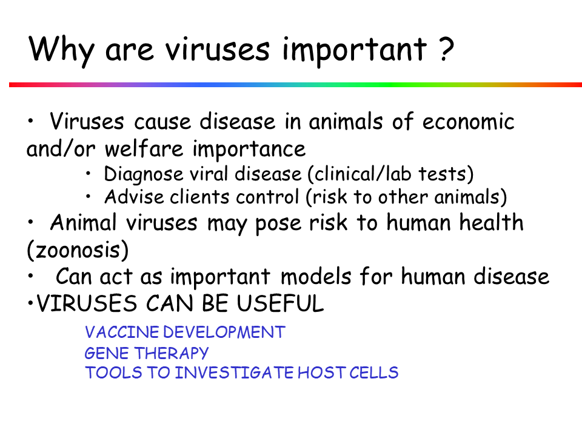

## Topic 1

---



---



---



---



---



---



---



---



---



---



---



---



---



---



---



---



---



---



---



---



---



---



---


---



---



---



---



---



---

